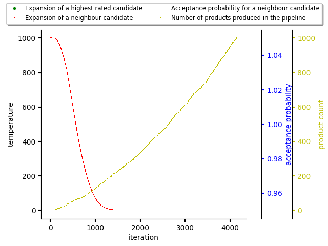
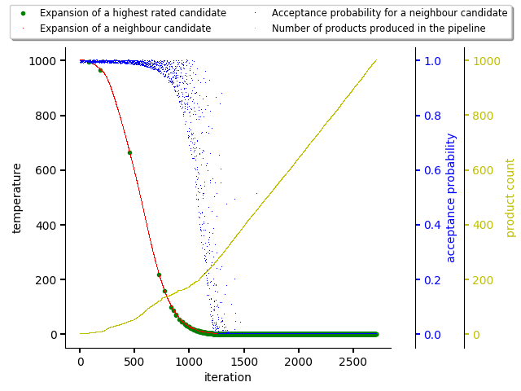
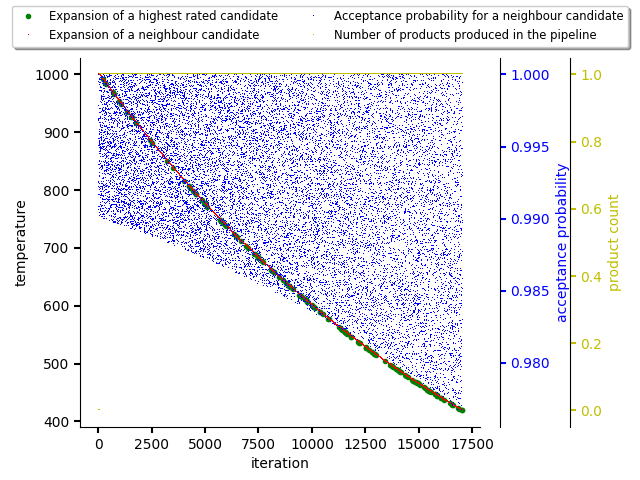

.. _anneal:

Adaptive simulated annealing
----------------------------

A very first implementation of Adviser and Dependency Monkey was designed to
load the whole dependency graph into memory and subsequently perform operations
on the weighted dependency graph. This way the dependency graph was adjusted
based on scores on edges and by traversing the dependency graph, there were
produced software stacks. Over time we abandoned this approach as it did not
scale with size of software stacks (e.g. a TensorFlow Python stack  required
circa 2.5k queries to the database just for dependency graph retrieval) and
`given the trend in Python ecosystem
<https://stackoverflow.blog/2017/09/06/incredible-growth-python//>`_ this
solution would also not be scalable.

The new implementation uses a stochastic approach based on Adaptive
simulated annealing (see `Wikipedia for a brief info
<https://en.wikipedia.org/wiki/Adaptive_simulated_annealing>`_ and also
`simulated annealing <https://en.wikipedia.org/wiki/Simulated_annealing>`_).
Software stacks are lazily expanded from initial states. The initial states are
formed out of combinations computed on all the resolved direct dependencies. As
an example, we can create a software stack that requests two packages to be
installed - `tensorflow` and `flask` - with specific version ranges:

.. code-block:: console

  tensorflow>=1.14,0
  flask>=1.0.0<=1.1.0

Thoth in this case performs offline resolution (based on pre-computed data in
the database which state how dependencies are structured) of direct
dependencies and finds matching releases given version range specification - an
illustrative example:

.. code-block:: console

  tensorflow==2.0.0
  tensorflow==1.14.0
  tensorflow==1.15.0
  flask==1.1.0
  flask==1.0.0

These releases are kept in buckets of a same package type (`tensorflow` and
`flask`) and sorted based on versions. All the possible combinations of these
direct dependencies create initial states (as described above) - in this case
we have 3*2=6 combinations in total:

.. code-block:: python

  >>> from itertools import product
  >>> from pprint import pprint
  >>> pprint(list(product(["tensorflow==2.0.0", "tensorflow==1.15.0", "tensorflow==1.15.0"], ["flask==1.1.0", "flask==1.0.0"])))
  [('tensorflow==2.0.0', 'flask==1.1.0'),
   ('tensorflow==2.0.0', 'flask==1.0.0'),
   ('tensorflow==1.15.0', 'flask==1.1.0'),
   ('tensorflow==1.15.0', 'flask==1.0.0'),
   ('tensorflow==1.14.0', 'flask==1.1.0'),
   ('tensorflow==1.14.0', 'flask==1.0.0')]

Each and every combination creates an initial state - see `State` abstraction
in sources for representation of a single state which is about to be expanded
resolved.

States are added to a `beam <https://en.wikipedia.org/wiki/Beam_search>`_ which
is designed to limit search space given the memory resources available (keep
only `beam.width` most promising states to be expanded/resolved).

The adaptive simulated annealing part of adviser's resolution algorithm takes
either a top rated state for expansion or, based on probability, picks some
another state from beam. This state is expanded by picking one dependency from
unresolved dependency listing and obtaining its direct dependencies making the
dependency resolved and direct dependencies becoming part of unresolved
dependency listing. A state is in so-called "final state" if all the dependencies
were resolved and there is no package version clash during resolution (no two
packages of a same type but in different versions or packages of a same type
coming from a different Python package source index - this is not acceptable in
Python packaging). The probability of picking a neighbour state (and not the
highest rated stack) from beam is computed based on, besides other parameters,
the temperature function which respects number of iterations and number of
final states produced so far (thus "adaptive" simulated annealing).

An example of an adaptive simulated annealing run that produced 1000 Python
stacks (final states) with no observations on scored packages and states can be
seen on the following figure. As the database for scoring states is empty
(Python stacks were just resolved without any guidenance), the probability of
picking a random state from beam is very high (the algorithm is looking for a
state which would be better than score of 0.0). This acceptance probability is
kept even the temperature dropped.

On the figure below, there was randomized scoring of top rated states for
demonstration purposes. As can be seen, the acceptance probability for picking
a neighbour state for expansion is decreasing with number of final states
produced and with decreasing temperature during iterations. This caused picking
the highest rated states for expansion and producing final states out of them
(fully resolved Python software stacks).

The last figure shows annealing behavior when there is found just one final
state and others are filtered out based on the score filtering (the final
states found have same score as the already produced ones so they are
discarded). As can be seen, the acceptance probability is kept high during the
whole annealing and the run is terminated once the whole state space is
explored (no other stack with different score than the produced one is found -
this can be accomplished by using
:class:`Sieve <thoth.adviser.strides.ScoreFilteringStride>` stride).

Expansion of states
===================

The expansion of states clones the expanded state and creates a combination of
all the packages which can occur following same principle similar to the one
described above when generating initial states (except the expanded state is
used as a "base state" which is cloned and used).

Using pipeline in annealing
===========================

The simulated annealing-based software stack resolution is respecting adviser
pipelines as described in :ref:`adviser pipeline section <pipeline>`. There are
implemented three abstractions to simplify package picking and handling:

* :class:`Boot <thoth.adviser.boot.Boot>`

* :class:`Sieve <thoth.adviser.sieve.Sieve>`

* :class:`Step <thoth.adviser.step.Step>`

* :class:`Stride <thoth.adviser.stride.Stride>`

* :class:`Wrap <thoth.adviser.wrap.Wrap>`

See the :ref:`adviser pipeline section <pipeline>` for more info.
