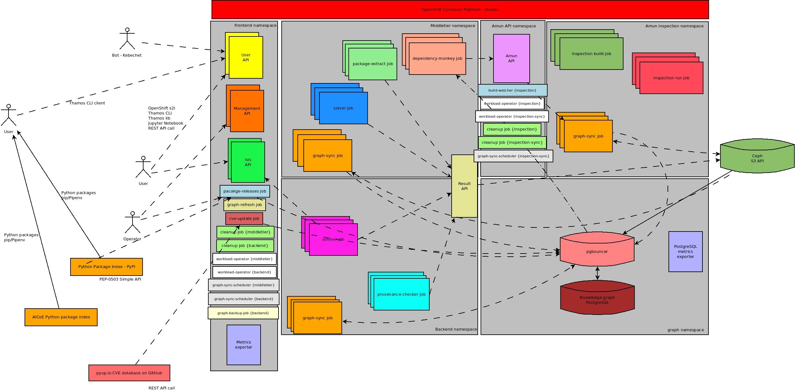

.. _architecture:

Thoth's architecture
--------------------

In this section, the reader gets a notion about Thoth architecture, requirements
for deployment and main Thoth's components.

The whole deployment is divided into multiple namespaces (or OpenShift
projects) - ``thoth-frontend``, ``thoth-middletier``, ``thoth-backend``,
``inspection-api``, ``inspection``, ``thoth-graph`` namespace and
``thoth-infra`` namespace.

Some of the components are deployed multiple times. They serve the same
purpose, but are parametrized - e.g. based on the namespace they operate on.
For example ``cleanup-job``, responsible for cleaning a namespace, is deployed
into ``thoth-frontend-stage`` two times to clean resources in
``thoth-middletier`` and ``thoth-backend``. This is shown in the architecture
overview as a rectangle with curly braces donating the namespace.

The main reason behind splitting the application into multiple namespaces are
workloads.  Thoth is running different type of one-time workloads based on an
trigger - for example a single ``adviser`` instance is created as per user
request. The workload is is then scheduled into a separate namespace (backend,
in case of adviser) and the given namespace acts as a pool of resources that
are available to be used for workloads. Other namespaces, for example frontend,
can be still used to scale, build, re-deploy or manage components.

Infra Namespace
###############

This namespace is separated for "infrastructure" related bits - for example all
the OpenShift templates are provisioned into this namespace. Also, the
`thoth-ops <https://github.com/thoth-station/thoth-ops>`_ (the link might be to
a private repo available only for Thoth developers) container responsible for
managing a Thoth deployment is created in this namespace.

Frontend Namespace
##################

The ``thoth-frontend`` is used as a management namespace. Services running in
this namespace have usually assigned a service account for running and managing
pods that are available inside the ``thoth-middletier`` and ``thoth-backend``
namespaces.

A user can interact with the user-facing API that is the key interaction point
for users or bots. `The user-facing API
<https://github.com/thoth-station/user-api>`_ specifies its endpoints using
Swagger/OpenAPI specification. See `Thamos repo and documentation - a library
and CLI for interacting with Thoth <https://github.com/thoth-station/thamos>`_
and `the user API service repo <https://github.com/thoth-station/user-api>`_
itself for more info. You can also find more info in the :ref:`integration
<integration>` section.

Besides user API, there are run periodically CronJobs that keep application in
sync and operational:

* `cleanup-job <https://github.com/thoth-station/cleanup-job>`_ - a job
  responsible for cleaning up resources left in the cluster

* `graph-refresh-job <https://github.com/thoth-station/graph-refresh-job>`_ - -
  a job responsible for scheduling analyses of packages that were not yet
  analyzed

* `graph-sync-job <https://github.com/thoth-station/graph-sync-job>`_ - a job
  responsible for syncing data in a JSON format persisted on Ceph to the Thoth's
  knowledge graph database

* `package-releases-job
  <https://github.com/thoth-station/package-releases-job>`_ - a job responsible
  for tracking new releases on Python's package index (the public one is
  `PyPI.org <https://pypi.org>`_, see also
  `AICoE index <https://tensorflow.pypi.thoth-station.ninja/>`_)

* `cve-update-job <https://github.com/thoth-station/cve-update-job>`_ - a job
  responsible for gathering CVE information about packages

* `workload-operator <https://github.com/thoth-station/workload-operator>`_ -
  an OpenShift operator responsible for scheduling jobs into namespaces, it
  respects allocated resources dedicated for the namespace in which jobs run

* `graph-sync-operator <https://github.com/thoth-station/graph-sync-operator>`_
  - an OpenShift operator responsible for scheduling graph-sync-jobs that sync
  results of analyzer job runs into Thoth's knowledge graph

Middletier Namespace
####################

The middletier namespace is used for analyzes and actual resource hungry tasks
that compute results for Thoth's knowledge graph. This namespace was separated
from the frontend namespace to guarantee application responsibility. All the
pods that require computing results for the knowledge graph are scheduled in
this namespace. This namespace has an allocated pool of resources for such
un-predicable amount of computational pods needed for this purpose (so pods are
not scheduled besides running user API possibly making user API
non-responsive).

A special service - `result API <https://github.com/thoth-station/result-api>`_
abstracts away any database operations (that can be possibly dangerous when
executing an untrusted code in Thoth's solvers). Each analyzer that is run in
the middletier namespace serialises its results to a structured JSON format and
these results are submitted to the user API service that stores results in the
Ceph object storage. All results computed by Thoth are first stored in a JSON
format for later analyses and making the graph instance fully recoverable and
reconfigurable based on previous results.

Currently, there are run following analyzers in the ``middletier`` namespace:

* `package-extract <https://github.com/thoth-station/package-extract>`_ - an
  analyzer responsible for extracting packages from runtime/buildtime
  environments (container images)

* `solver <https://github.com/thoth-station/solver>`_ - an analyzer run to
  gather information about dependencies between packages (on which packages the
  given package depends on?, what versions satisfy version ranges?) and gathers
  observations such as whether the given package is installable into the given
  environment and if it is present on a Python package index

* `dependency-monkey <https://github.com/thoth-station/dependency-monkey>`_ -
  an analyzer that dynamically constructs package stacks and submits them to
  `Amun <https://github.com/thoth-station/amun-api>`_ for dynamic analysis (can
  be the given stack installed?, what are runtime observations - e.g.
  performance index?) (this is currently WIP)

Backend Namespace
#################

The backend part of application is used for executing code that, based on
gathered information from analyzers run in the middletier namespace, compute
results for actual Thoth users (bots or humans).

This namespace has, as in the case of middletier namespace, allocated pool of
resources. Each time a user requests a recommendation, pods are dynamically
created in this namespace to compute results.

As of now, there are run following analyzers to compute recommendations for
a user:

* `adviser <https://github.com/thoth-station/adviser>`_ - a recommendation
  engine computing stack level recommendations for a user for the given runtime
  environment

* `provenance-checker <https://github.com/thoth-station/adviser>`_ - an
  analyzer that checks for provenance (origin) of packages so that a user uses
  correct packages from correct package sources (Python indexes) - note that
  Python :ref:`packaging format does not guarantee this - neither  Pipenv nor pip
  itself <compatibility>`! (the implementation now lies in the `adviser repo
  <https://github.com/thoth-station/adviser>`_)

Amun
####

Amun is a standalone project within Thoth - it's aim is to act as an execution
engine. Based on requests coming in from Thoth itself (dependency-monkey
jobs), it can build the requested application (create builds and image streams)
on requested runtime environment (a container base image with optionally
additional native packages installed in) and execute the supplied testsuite to
verify whether the given application stack works on targeted hardware (also
part of the dependency-monkey request). The result of Amun API are
"observations" from inspection jobs (build and run inspections). These
observations are subsequently synced into the knowledge graph as part of
graph-sync-job.

For more information, see `Amun API repository
<https://github.com/thoth-station/amun-api>`_ and autogenerated `Amun client
<https://github.com/thoth-station/amun-client>`_. See also `the performance
repo <https://github.com/thoth-station/performance>`_ for scripts used for
performance related inspections.

Graph Namespace
###############

A separate namespace was created for database related deployments. Components
running in this namespace:

* Thoth's knowledge graph - a `PostgreSQL database <https://www.postgresql.org/>`_

* ``pgbouncer`` - a `PostgreSQL bouncer <https://www.pgbouncer.org/>`_ to recycle
  and manage connections to the database - all the components talk to this component
  when a query is performed

* ``pgweb`` - a `web interface <https://sosedoff.github.io/pgweb/>`_ to interact with
  Thoth's knowledge graph

* ``postgresql-metrics-exporter`` - PostgreSQL related metrics (see Grafana
  dashboards section) for the main database observability

Thamos
######

`Thamos <https://thoth-station.ninja/docs/developers/thamos>`_ is a CLI tool
created for end-users of Thoth. Thamos offers a simple command line interface
to consume Thoth's advises (recommendations) and Thoth's provenance checks both
done against data stored in the knowledge graph. The tool packs in an
automatically generated Python client library from User API OpenAPI
specification The library can be used to integrate with Thoth. See `Thamos
repository for documentation and an example usage
<https://thoth-station.ninja/docs/developers/thamos>`_.

Kebechet
########

Another consumer of Thoth's data is a bot called `Kebechet
<https://github.com/thoth-station/kebechet>`_ that operates directly on
repositories on hosted on GitHub or GitLab and it opens pull requests or issues
automatically for users. See :ref:`integration documentation for more
info <integration>`.

Build Watcher
#############

This component was designed to automatically watch for cluster events - wait
for OpenShift builds to finish and submit the resulting container image
produced to Thoth for analysis. As the container image registry is usually
cluster internal, without any route exposed to the world, build-watcher can
also cooperate with external registries. Documentation can be found in `the
README file in the GitHub project
<https://github.com/thoth-station/build-watcher>`_.

Grafana dashboards
##################

To guarantee application observability, there were created `Grafana
<https://grafana.com/>`_ dashboards. Thoth related metrics are aggregated by
a component called "metrics exporter". These metrics are visualized in multiple
dashboards. To observe knowledge graph database, `postgresql-metrics-exporter
<https://github.com/wrouesnel/postgres_exporter>`_ component was deployed.

A brief history of Thoth
------------------------

Thoth started as an experiment in `AICoE <https://github.com/aicoe>`_ - a team
called "AI Center of Excellence" in Red Hat's office of the CTO. During development,
the main database was exchanged multiple times. Initially, there was used
`JanusGraph database <https://janusgraph.org/>`_. Even thought the JanusGraph database
served its purpose (storing graph related data), given the number of requests
performed by the application, JanusGraph did not scale well. Also, maintainability of
the JanusGraph instance was not satisfying given the team size (2 developers).
The next database used, `Dgraph <https://dgraph.io/>`_ addressed most of the issues
and led to a cooperation between Thoth team and AIOps team - you can `find more details
in this article <https://next.redhat.com/2019/11/18/prometheus-anomaly-detection/>`_.
Unfortunately, we reached scalability issues of Dgraph instance and were forced to look
for another solution that would serve the main database purpose:

.. note::

  The term "graph" is used in Thoth's sources all over the place. This term was
  adopted as a "graph database" was initially used. Even though the main
  database is not graph database anymore, Thoth's knowledge base can still be
  seen as a graph knowledge base - a database storing graph data not
  necessarily in a graph form.

Another reason behind switching away from graph databases was Python ecosystem
size. The main query for obtaining dependencies (in the adviser and Dependency
Monkey implementation) initially retrieved the whole dependency graph at one
shot - this solution did not scale well for larger software stacks (such as
TensorFlow) and we were encountering serialization issues - when JanusGraph, as
well as Dgraph were used. The query had to be broken down into multiple requests
into Thoth's knowledge base. At the end, we ended up with a query that could be
easily transformed into an SQL query with 3 joins.

Another part of Thoth, that was rewritten multiple times, is the core
recommendation algorithm. Initially, adviser and Dependency Monkey loaded the
whole dependency graph into memory and then, operations on a weighted N-ary
dependency graph were made. These operations guaranteed resolution of higher
scored packages faster during dependency graph traversals that were made to
resolve software stacks. This implementation was then rewritten into C/C++ to
gain performance. Unfortunately, the approach had to be abandoned given the
number of requests needed to be performed to obtain large software stacks (in
case of a TensorFlow stack, 2.5k requests were made just to obtain the
dependency graph that required a lot of time just to perform data transfer).
Considering `how Python ecosystem is growing
<https://stackoverflow.blog/2017/09/06/incredible-growth-python/>`_, this
solution would not scale well in the future.

All the above let to a transition to a more stochastic approach - the
implementation design of Thoth's adviser supports this fact with :ref:`resolver
<resolver>`, :ref:`predictor <predictor>` abstractions and a :ref:`stack
resolution pipeline <pipeline>` used for scoring and producing highly optimized
software stacks.

A note on Argo workflows
########################

There are ongoing efforts to port deployment to run Argo workflows. This way,
some of the components will be replaced by Argo capabilities, notably:

* result-api - Argo has S3 support for managing produced artifact uploads
* workload-operator
* graph-sync-scheduler

Requirements for Thoth deployment
---------------------------------

All the related Ansible playbooks for provisioning Thoth are present in the
`thoth-ops <https://github.com/thoth-station/thoth-ops>`_ repository (might require
developer's access).

Main requirements for a proper cluster deployment:

* middletier, backend and inspection namespaces should have restricted
  `namespace resources allocated
  <https://kubernetes.io/docs/concepts/policy/resource-quotas/>`_ when it comes
  to CPU, memory or number of pods that can run in the namespace

* network of the graph namespace should be joint with frontend, middletier and
  backend namespace as pods running in these namespaces require access to
  Thoth's knowledge graph instance

* `custom resources
  <https://kubernetes.io/docs/concepts/extend-kubernetes/api-extension/custom-resources/>`_
  related to Argo for `Argo workflows <http://argo.io/>`_

* optionally but recommended, solver pods can have network policy set up to
  restrict network access - this restriction is created as solver jobs execute
  possibly untrusted software coming from the Internet (PyPI packages)

Follow `documentation and Ansible playbooks in thoth-ops repository
<https://github.com/thoth-station/thoth-ops>`_ for more info as well as the `core
repository <https://github.com/thoth-station/core>`_.
