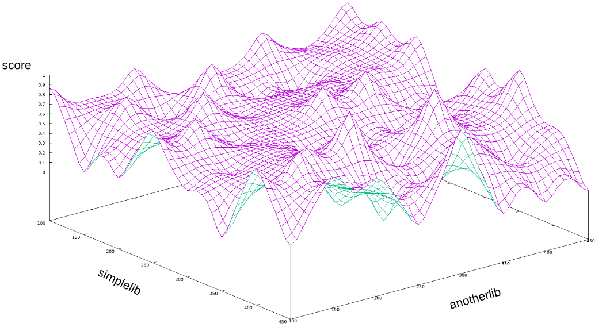
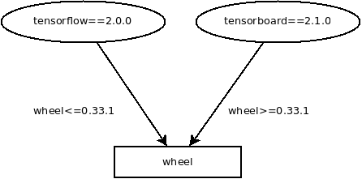

.. _compatibility:

Thoth's adviser recommendation format
=====================================

Thoth's recommendations respects format used by `a tool called Pipenv
<https://github.com/pypa/pipenv>`_ for requirements. From Pipenv's main pages:

  Pipenv is a tool that aims to bring the best of all packaging worlds
  (bundler, composer, npm, cargo, yarn, etc.) to the Python world.

  It automatically creates and manages a virtualenv for your projects, as well
  as adds/removes packages from your Pipfile as you install/uninstall packages.
  It also generates the ever-important Pipfile.lock, which is used to produce
  deterministic builds.

  Pipenv is primarily meant to provide users and developers of applications
  with an easy method to setup a working environment.

By browsing the documentation you can see that Pipenv uses two files -
``Pipfile`` and ``Pipfile.lock``. The first stated states direct dependencies
of your application and the latter one states fully pinned down software
packages installed to run your application.

Thoth's adviser adopted this format from numerous reasons, the main are:

* as stated above, deterministic builds
* guaranteed provenance of installed packages by using digests of artifacts installed
* straightforward configuration of Python packages used
* separation of your development packages
* configuration of Python interpreter used
* straightforward integration with OpenShift's source-to-image builds
* straightforward integration with Jupyter Notebooks
* additional `neat configuration options <https://pipenv.kennethreitz.org/en/latest/advanced/>`_

As the format produced by Thoth's adviser is compatible with Pipenv, you can
directly use Pipenv on the recommended software stack. See :ref:`integration`
section for more info on how to integrate with Thoth and benefit from its
recommendations.

Compatibility with pip/Pipenv resolver
======================================

As Thoth is also considering used software environment, it can take into
account `environment markers <https://www.python.org/dev/peps/pep-0496/>`_. For
example, dependencies that are installed conditionally based on environment
markers can be removed from software stack - Thoth's lockfile consists of
packages that are **really** needed to run your application, given version
range specification and pre-computed environment markers for target software
environments. That's why your resolved application stack is optimized for the
given software environment (and also hardware environment in case of hardware
specific recommendations) and might not work properly on other environments
(e.g. different Python interpreter versions).

Other issues might arise when Thoth's resolution pipeline takes into account
native packages and their ABI versions present in the target software
environment - again, packages that depend on different or non-existing native
packages can simply fail on assemble time (installation) or runtime when
different software environment is used in comparision to the one provided to
Thoth's adviser.

Resolution of Thoth's adviser might come up with a software stack that would
never be produced by pip or Pipenv. The reason is a known issue - `pip is
lacking proper resolver <https://github.com/pypa/pip/issues/988>`_. As Pipenv
uses pip (Pipenv actually bundles pip and virtualenv into one package) this
issue is inherited and software stacks resolved by pip/Pipenv might be not
correct (or can even fail). Thoth's adviser is a drop-in replacement which
provides server side resolution with additional guidance on installed
packages based on observations stored in Thoth's knowledge base.

.. note::

  It's a good practice to create different Thoth configuration files (e.g.
  different git branches) if you plan to run your application on different
  software or hardware environments and use Thoth's recommendations.

Environment markers applied on direct dependencies are not evaluated during
resolution done on server but are taken into account once packages are
installed by Pipenv.

Python package indexes
======================

By design, ``pip`` treats all the indexes as mirrors. If you build your own
package (e.g. optimized builds of TensorFlow) and provide it on your own index,
``pip`` has no direct configuration option to explicitly specify index that
should be used when installing the package. There are options like
``--extra-index-url`` that can add additional Python package indexes, however
they are treated as fallbacks or mirrors. You can also supply digests of
installed artifacts, but...

On the other hand, Pipenv provides a configuration option for `specifying
custom package indexes
<https://pipenv.kennethreitz.org/en/latest/advanced/#specifying-package-indexes>`_.
Thoth respects this configuration and software stacks produced that use
``Pipfile.lock`` format always specify from which index the given package came
from. To prevent installation undesired artifacts, artifacts digests are
provided.

An example of a ``Pipfile`` that configures two Python package indexes - `PyPI
<https://pypi.org/simple>`_ and `AICoE Python package index
<https://tensorflow.pypi.thoth-station.ninja/>`:

.. code-block:: toml

  [[source]]
  url ="https://tensorflow.pypi.thoth-station.ninja/index/manylinux2010/AVX2/simple/"
  verify_ssl = true
  name = "redhat-aicoe-experiments"

  [[source]]
  url = "https://pypi.python.org/simple"
  verify_ssl = true
  name = "pypi"

  [requires]
  python_version = "3.6"

  [packages]
  tensorflow = {version="==2.0.0", index="redhat-aicoe-experiments"}

  [pipenv]
  allow_prereleases = true

A note on shared dependencies in a dependency graph
===================================================

The state space, as described in section :ref:`introduction`, is a discrete
state space (of final states) of all the possible combinations of packages
forming the software stack. A surface created by interpolating the scoring
function of the state space for different versions of packages ``simplelib`` and
``anotherlib`` is shown bellow (assuming only packages ``simplelib`` and
``anotherlib`` can form the resulting software stack).

         forming a surface.

Note however that not all combinations of packages are valid, meaning the
scoring function is not defined for all the possible combinations. Let's
suppose we have packages `TensorFlow <https://pypi.org/project/tensorflow/>`_
and `TensorBoard <https://pypi.org/project/tensorboard/>`_ in our stack. Let's
suppose we consider only a single version of each package for simplicity -
``tensorflow==2.0.0`` and ``tensorboard==2.1.0``. Let's both of these versions
depend on a package `wheel <https://pypi.org/project/wheel>`_ as shown on the
figure bellow:

To satisfy version range specification, the only valid resolution leads to
``wheel==0.33.1`` (not considering pre, post releases or release candidates).
Note that the implementation does not necessarily need to include such version
(or versions), especially considering ``limit_latest_versions``, state space
sampling and state space restrictions in beam. In such cases, it is recommended
to pin down versions of such packages (as ``wheel`` in the example) explicitly
as a hint to resolver. Otherwise resolution might fail. See logs of an adviser
run to spot such cases.
