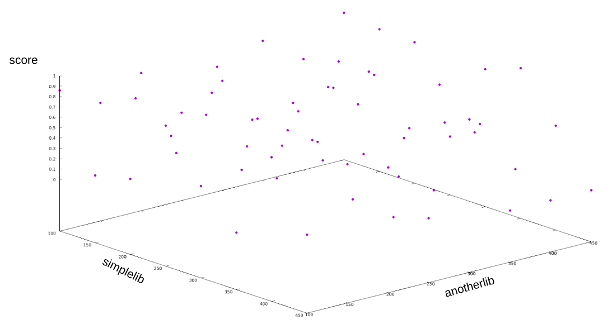
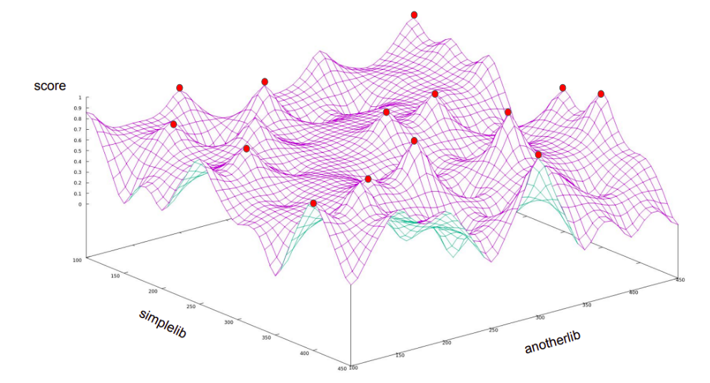
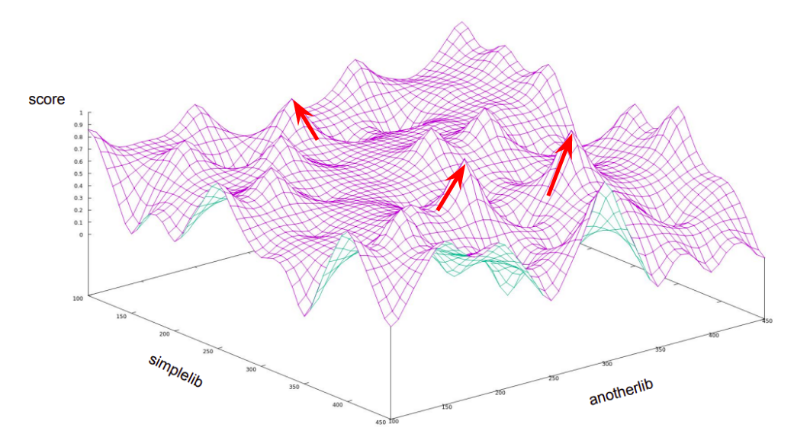

.. _introduction:

Introduction to Thoth's adviser principles
------------------------------------------

In the upcoming section you can find discussion and intuition behind Thoth's
adviser logic and nomenclature used in Thoth repositories, sources and
documentation.

Intuition behind Thoth's recommendations
========================================

Let's consider an application that has two dependencies - a package called
``simplelib`` and ``anotherlib``. These dependencies can be installed in
different versions and do not require any additional packages to be installed.
Let's have a function that scores an application based on "how good it is" when
different versions of ``simplelib`` and ``anotherlib`` are used. The semantics
for "how good" can be different, but one can imagine scoring based on
performance, security vulnerabilities present and/or application misbehaviour
(or any other scoring you can come up with).

If we create all the combinations of ``simplelib`` and ``anotherlib`` that can
be produced and we score these combinations using our scoring function we get a
discrete results as shown on the following figure:

By interpolating these values we get a surface as shown on the next figure, this
visualization is also more intuitive:

.. image:: _static/state_space_interpolated.png
   :target: _static/state_space_interpolated.png
   :alt: Interpolated discrete values in the state space forming a surface.

As can be seen, we get different score based on different versions of
``simplelib`` and ``anotherlib`` combinations. Thoth's adviser, when computing
recommendations, tries to find the highest values of the scoring function - the
highest spikes present (assuming the higher number of score, the better
software stack is).

Thoth's :ref:`resolver <resolver>` can produce all the combinations of packages,
considering Python ecosystem resolution, and can be guided using
:ref:`predictor <predictor>` to find high values of score faster:

Considering real-world applications, software stacks can be formed out of
multiple packages coming in different versions. Packages are introduced into a
software stack based on dependency requirements of direct or indirect
dependencies that can be restricted using version range specifications (making
some of the combinations invalid). The shown 3D figures above show scoring
function for two different packages in a software stack. This scoring function
can be generalized to n-dimensional space when a software stack is made out of
n-1 packages (at most) and n-th dimension is always result of the scoring
function used.

Thoth's :ref:`resolver <resolver>` approach of resolving software stacks is
to expand dependency graphs (lazily), instead of directly implementing
`3SAT problem <https://en.wikipedia.org/wiki/Boolean_satisfiability_problem>`_
as in case of other resolvers. See :ref:`resolver <resolver>` documentation
for more info.

Nomenclature
============

In adviser docs but also in other Thoth repositories, one can find the following
terms:

* initial state - state of resolution in resolver that is made out of resolved direct dependencies into a concrete version coming from a Python package index
* state - generally speaking any resolver state
* final state - a state that has no more packages left for resolution (resolved packages form fully resolved software stack) and can become a pipeline product
* state space - a space formed out of all the possible resolver states
* direct dependencies - declared direct dependencies of an application (directly used in the application)
* transitive dependencies - all the direct and indirect dependencies of an application - `see transitive relation for more info <https://en.wikipedia.org/wiki/Transitive_relation>`_
* library usage - result of a static source code analysis done by `Thoth's Invectio <https://github.com/thoth-station/invectio>`_ which keeps track of libraries and library symbols used in the user's source code
* runtime environment - hardware and software environment
* software environment - native packages, Python interpreter version and other software available when running an application (might be seen as a container image)
* hardware environment - hardware used to run an application - for example information about CPU/GPU used
* lockfile - a file containing all the packages resolved to a specific version - e.g. ``Pipfile.lock``
* project - an abstraction used to describe user's application with direct dependencies, optional lockfile and information about hardware and software environments used
* resolver - an abstraction that can resolve software stacks based on resolution as defined in the Python ecosystem and based on stack generation pipeline
* predictor - an abstraction that helps resolver resolve software stacks faster by guiding during resolution - see :ref:`predictor for more info <predictor>`
* pipeline - in Thoth's context, a stack resolution pipeline is used to generate and score Python software stacks for certain quality - see :ref:`pipeline for more info <pipeline>`
* pipeline units - boot, sieve, step, stride, wrap
* dependency monkey - one of Thoth's components - Dependency Monkey can generate all the combinations of a software stacks and, optionally, submit them to Amun for additional verification, testing and observation aggregation
* Thoth - one of the ancient Egyptian deities
* Thoth-Station - see `Thoth Station <https://expanse.fandom.com/wiki/Thoth_Station>`_
* Amun - an executor used in Thoth to verify, install and run applications - see `Amun repository for more info <https://github.com/thoth-station/amun-api>`_
* performance indicator - a test that is performed on a part of a library to aggregate performance characteristics - see `performance repo for more info <https://github.com/thoth-station/performance>`_
* provenance checks - checks for provenance of installed packages - checks on their integrity and source
* (Python) software stack - a fully pinned down (resolved) software stack made out of Python packages (direct and transitive ones) needed to run a Python application
* Argo - workflow management used in Thoth to `run workflows in an OpenShift cluster <https://argoproj.github.io/>`_
* adviser - one of the main components in Thoth that can resolve software stacks - see `adviser repository <https://github.com/thoth-station/adviser>`_
* solver - one of the main components in Thoth that pre-computes information about dependencies and other metadata for Thoth's recommendation engine - see `solver repo <https://github.com/thoth-station/solver>`_
* OpenShift s2i (source-to-image) - a build process defined in OpenShift for building applications - see `Source-to-Image (S2I) Build <https://docs.openshift.com/enterprise/3.0/architecture/core_concepts/builds_and_image_streams.html#source-build>`_
* Jupyter Notebooks - see `jupyter.org <https://jupyter.org/>`_ and also `Thoth related Jupyter Notebooks with experiments <https://github.com/thoth-station/notebooks>`_
* Thamos - a CLI for integrating with Thoth - see :ref:`integration <integration>` and `Thamos repository on GitHub <http://github.com/thoth-station/thamos>`_
* pip - see `pip <https://en.wikipedia.org/wiki/Pip_(package_manager)>`_
* Pipenv - see `Pipenv docs <https://pipenv.kennethreitz.org/>`_
* Adaptive Simulated Annealing - see `Simulated Annealing <https://en.wikipedia.org/wiki/Simulated_annealing>`_ and `Adaptive Simulated Annealing <https://en.wikipedia.org/wiki/Adaptive_simulated_annealing>`_
* Python triplet - a triplet made out of package name, package version (locked down) and a URL to Python package index from where the Python package came from
* Python package index - a repository of Python packages that is compliant with `PEP-503 <https://www.python.org/dev/peps/pep-0503/>`_ - an example can be `PyPI <https://pypi.org>`_ or `AICoE index <https://tensorflow.pypi.thoth-station.ninja/>`_
