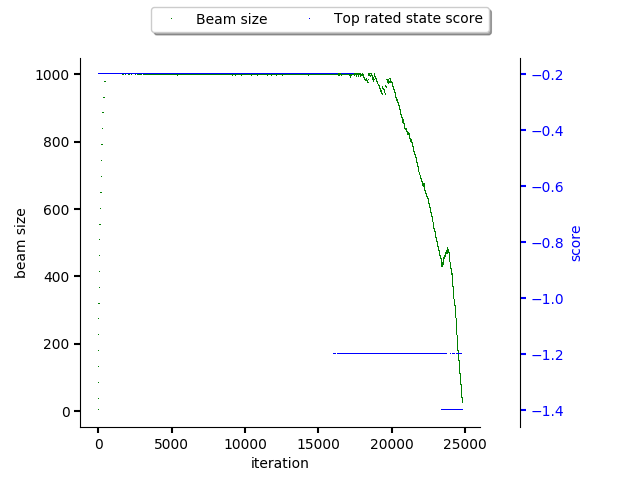

.. _pipeline:

State expansion pipeline
------------------------

In this section, one can find the developer's introduction to state expansion
pipeline used in Thoth's adviser that expands states to produce pipeline
products.

The pipeline is used to prepare, generate, filter and score partially or fully
resolved software stacks, abstracted into a :class:`State
<thoth.adviser.state.State>`.  The pipeline is run within :ref:`resolver
<resolver>` and can be triggered by two main methods:

* :func:`Resolver.resolve_products <thoth.adviser.resolver.Resolver.resolve_products>`
* :func:`Resolver.resolve <thoth.adviser.resolver.Resolver.resolve>`

The first one is a lower level API for obtaining pipeline products that are
yielded during resolution. The latter one reports back a pipeline run
:class:`Report <thoth.adviser.report.Report>` (and uses the first one under the
hood to obtain products). Note the latter one waits for the whole pipeline to
finish, whereas the first one yields products during run.

An example of a resolver run that runs the pipeline under the hood for
computing recommendations:

.. code-block:: python

  from pathlib import Path

  from thoth.common import RuntimeEnvironment
  from thoth.adviser import Resolver
  from thoth.adviser.enums import RecommendationType
  from thoth.adviser.predictors import AdaptiveSimulatedAnnealing
  from thoth.python import Project

  runtime_environment = RuntimeEnvironment()
  runtime_environment.operating_system.name = "fedora"
  runtime_environment.operating_system.name = "31"
  runtime_environment.python_version = "3.7"
  runtime_environment.cuda_version = "9.0"
  runtime_environment.hardware.cpu_model = 142

  project = Project.from_files(
      pipfile_path="./Pipfile",
      runtime_environment=runtime_environment
  )

  resolver = Resolver.get_adviser_instance(
      beam_width=4,
      count=3,
      library_usage=None,
      limit=10000,
      limit_latest_versions=5,
      predictor=AdaptiveSimulatedAnnealing(),
      project=project,
      recommendation_type=RecommendationType.LATEST,
  )

  report = resolver.resolve(with_devel=True)
  print(report.to_dict())

As you can see above, the resolver has quite a few arguments to be passed:

* ``beam_width`` - limitation for state space that should be taken into account during a resolver run (see beam section bellow for more info)
* ``count`` - number of software stacks reported back by the resolver
* ``library_usage`` - static source code analysis as done by `Thoth's Invectio <https://github.com/thoth-station/invectio>`_ - this library usage states libraries and symbols used from these libraries that can help with application specific recommendations (e.g. recommending different versions of TensorFlow for applications using convolutional layers)
* ``limit`` - number of software stacks (final states) scored in total - resolver is stopped once this limit is reached or there are no more states in the beam to be resolved
* ``limit_latest_versions`` - limit number of latest versions for all the packages in the dependency graph considered during resolution to reduce state space considered
* ``predictor`` - an implementation of :class:`Predictor <thoth.adviser.predictor.Predictor>` to be used together with resolver to resolve software stacks
* ``project`` - instance of ``Project`` available in ``thoth-python`` library that provides direct dependencies and information about runtime environment used to run and build the application
* ``recommendation_type`` - type of targeted recommendations - see :class:`RecommendationType <thoth.adviser.enums.RecommendationType>`

A similar method, :func:`Resolver.get_dependency_monkey_instance
<thoth.adviser.resolver.Resolver.get_dependency_monkey_instance>` obtains
resolver for a :ref:`Dependency Monkey run <dependency_monkey>`. When creating
a Dependency Monkey resolver, resolver asks for :class:`DecisionType
<thoth.adviser.enums.DecisionType>` instead of :class:`RecommendationType
<thoth.adviser.enums.RecommendationType>`.

As you can see, there is no pipeline configuration passed to the resolver
instance. In such cases, resolver iterates over shipped pipeline units
available and tries to create a pipeline configuration that is suitable for the
given set of parameters - see :func:`Unit.should_include
<thoth.adviser.unit.Unit.should_include>` method and :ref:`unit documentation
<unit>` on information how to let pipeline units be included in a certain
resolver run. In other words, the pipeline configuration is dynamically
created based on resolver's input parameters and hyperparameters.

If you would like to provide your own pipeline configuration, you can do so by
explicitly passing ``pipeline_config`` argument which states a dictionary
representation of a pipeline configuration or directly instance of
:class:`PipelineConfig <thoth.adviser.pipeline_config.PipelineConfig>` with all
the pipeline units instantiated and configured.

Pipeline and resolver execution
===============================

Before any resolution, resolver calls :func:`Unit.pre_run
<thoth.adviser.unit.Unit.pre_run>` method that can be used in any pipeline unit
implementation to signalize a new resolution. It's a good practice to set any
initialization here as pipeline units are instantiated once per resolver. If
there are run multiple resolutions for the same resolver instance, the pipeline
unit instances will be shared.

All pipeline units are grouped based on their type in the
:class:`PipelineConfig <thoth.adviser.pipeline_config.PipelineConfig>` and
resolver runs respect they relative ordering when pipeline units are executed.

The very first pipeline units triggered are pipeline units of type :class:`Boot
<thoth.adviser.boot.Boot>`. They are triggered prior to any resolution done -
see :ref:`boot unit documentation for more info <boots>`.

Once all :class:`Boot <thoth.adviser.boot.Boot>` units are successfully
executed, resolver resolves all the direct dependencies (that are sorted and
filtered out based on ``limit_latest_versions`` configuration option) of the
application and executes pipeline units of type :class:`Sieve
<thoth.adviser.sieve.Sieve>` to filter out packages that should not be
considered during resolver run. See :ref:`sieve pipeline unit documentation for
more information <sieves>`.

Once sieves filter out packages in unwanted versions, resolver creates initial
states that are formed out of all the combinations of packages in different
versions that can occur in a software stack. As packages in different versions
are sorted based on their version string semantics, the very first combination
has always the latest versions of all the packages (this fact is used for
example in hill climbing in the :ref:`adaptive simulated annealing approach
<annealing>`).  For each newly created initial state, there are run
:ref:`pipeline steps <steps>` that decide whether inclusion of a package
version is valid to a state - this is done for each and every package-version
combination.

If a state is accepted, it is added to the resolver beam as a state to be
considered during resolver run, respecting beam width parameter.

The resolver than picks a state  stored in the beam based on
:ref:`predictor's decision <predictor>` and resolves not yet resolved
dependencies in the state. The resolution of a dependency makes a dependency
resolved and all its dependencies, if any, unresolved. Resolver, again,
runs all the sieves on newly introduced dependencies into the state and
pipeline steps to verify and score the given resolver step.

A state is considered as a final if there are no more unresolved dependencies.
Such state is then passed to all :ref:`pipeline strides <strides>` that decide
whether the final state should become a pipeline product or not. Once it is
accepted all pipeline units of type :ref:`wrap <wraps>` are called to wrap up
resolution of the state. After all, state is converted into a pipeline product
and yielded, possibly becoming part of a pipeline report, if requested so.

Context and Beam
================

There are three main abstractions that are fundamental when creating any
pipeline unit or predictor for Thoth's adviser:

* :class:`Context <thoth.adviser.context.Context>` - context carried during the whole resolver run; states all the necessary information for pipeline units and for predictor
* :class:`PipelineBuilderContext <thoth.adviser.pipeline_builder.PipelineBuilderContext>` - context used during pipeline creation by :class:`PipelineBuilder <thoth.adviser.pipeline_builder.PipelineBuilder>` if pipeline configuration was not explicitly provided - see :ref:`unit section for more information <unit>`
* :class:`Beam <thoth.adviser.beam.Beam>` - simply, `beam <https://en.wikipedia.org/wiki/Beam_search>`_, a pool of states kept

Beam is an abstract data type maintained by resolver that keeps track of pool
of states that are about to be (possibly) resolved. This pool can have
restricted width which limits number of states kept in memory and limits number
of states considered during resolution.

It's possible to request a history plot for beam size and the highest rated
stack score for introspection purposes using the ``--plot`` option or by
calling :func:`Beam.plot <thoth.adviser.beam.Beam.plot>`. The figure below
shows beam history during resolution of 1000 TensorFlow software stacks by
sampling the state space using :ref:`adaptive simulated annealing <annealing>`.
CVE penalization was the only :ref:`pipeline step <steps>` used during
resolution, resolver did approximately 2500 resolution rounds to score 1000
software stacks (``limit`` parameter to adviser). It took approx. one and half
minute to produce these 1000 stacks on a local machine, considering just 5 most
recent libraries in a stack formed out of ``tensorflow`` and ``flask``
packages.

As can be seen, the beam limited number of states taken into consideration
until approx. 1800th round. After this round, the temperature in the
:ref:`adaptive simulated annealing <annealing>` started to drop so resolver
ended up expanding just the top rated state based on :ref:`adaptive simulated
annealing <annealing>` predictor output (so stack resolution pipeline started
to produce more products - resolved software stacks - and reduced production
of non-final states).

.. note::

  It's good to find the right balance for the beam width. A beam that is too
  small restricts the state space too much which can cause that no software
  stack is resolved. Too big beam can lead to a very large state space to be
  explored and consumption of too much CPU time (and actual time) to produce
  software stacks.

Pipeline configuration creation
===============================

Each pipeline unit provides a class method called `should_include` which is
executed on the :class:`pipeline configuration creation
<thoth.adviser.pipeline_config.PipelineConfig>` (that states a list of boots, sieves,
steps, strides and wraps to be included in the pipeline). The class method returns a
dictionary stating unit configuration if the given unit should be used (an
empty dictionary if no configuration changes to the default unit configuration are done), a
special value of `None` indicates the given pipeline unit should not be added
to the pipeline configuration.

The `should_include` unit class method is in fact called multiple times during
pipeline configuration construction. The pipeline builder iterates over all
pipeline units and asks if they should be included in the pipeline
configuration until no change to the pipeline configuration is made. This way
pipeline can be constructed autonomously where a developer of a pipeline unit
just programatically states when the given pipeline unit should be included in
the pipeline configuration (stating dependencies on other pipeline units or
conditionally add pipeline unit under specific circumferences). An example can
be a pipeline unit which includes scoring based on performance indicators done
on `conv2d <https://www.tensorflow.org/api_docs/python/tf/nn/conv2d>`_ used in
a TensorFlow application:

.. code-block:: python

    # snip ...

    @classmethod
    def should_include(
        cls, context: PipelineBuilderContext
    ) -> Optional[Dict[str, Any]]:
        """Include this pipeline unit if user uses TensorFlow and there are done calls to conv2d."""
        if context.is_included(cls):
           # This pipeline unit is already included in the pipeline configuration, we don't
           # need to include this pipeline unit multiple times.
           #
           # The same method `is_included' can be used to inspect if pre-requisite pipeline
           # units are present in the pipeline configuration.
           return None

        if context.library_usage and "tf.nn.conv2d" in context.library_usage.get("tensorflow", {}):
           # As an example - adjust parameter `score_factor' of this pipeline
           # unit to 2.0, which will override the default one.
           return {"score_factor": 2.0}

    # ... snip

Each unit type respects relative ordering and units are grouped based on their
type - for example the very first sieve added is run first, then a second one
and so on respecting the relative order of sieves in the pipeline configuration
(the order in which they were included). This logic applies to all pipeline
unit types - :ref:`boots <boots>`, :ref:`sieves <sieves>`, :ref:`steps
<steps>`, :ref:`strides <strides>` and :ref:`wraps <wraps>`.

See implementation of :class:`PipelineBuilderContext
<thoth.adviser.pipeline_builder.PipelineBuilderContext>` for more info on
provided methods that can be used during pipeline configuration creation.

Note the resolution algorithm with pipeline units is shared for computing
advises and for Dependency Monkey to test and evaluate characteristics of
software stacks. You can use methods provided by :class:`PipelineBuilderContext
<thoth.adviser.pipeline_builder.PipelineBuilderContext>` to check if the
pipeline configuration is created for computing advises or whether the created
pipeline configuration is used in Dependency Monkey runs.

Instrumentation of resolver's pipeline units
============================================

Besides letting pipeline units to autonomously register into the pipeline
configuration, the pipeline configuration can be supplied also explicitly. This
is useful for instrumenting resolver during :ref:`Dependency Monkey
<dependency_monkey>` runs. In that case, the :func:`Unit.should_include
<thoth.adviser.unit.Unit.should_include>` method is never called and the
configuration of the pipeline is explicitly encoded in a JSON format:

.. code-block:: json

  {
    "pipeline": {
      "boots": [],
      "sieves": [
        {
          "configuration": {},
          "name": "CutPreReleasesSieve"
        },
        {
          "configuration": {},
          "name": "PackageIndexSieve"
        },
        {
          "configuration": {
            "without_error": true
          },
          "name": "SolvedSieve"
        }
      ],
      "steps": [
        {
          "configuration": {
            "cve_penalization": -0.2
          },
          "name": "CvePenalizationStep"
        }
      ],
      "strides": [],
      "wraps": []
    }
  }

Each unit is referenced by its class name and is included from the
thoth-adviser's implementation (modules :py:mod:`thoth.adviser.boots`,
:py:mod:`thoth.adviser.sieves`, :py:mod:`thoth.adviser.steps`,
:py:mod:`thoth.adviser.strides` and :py:mod:`thoth.adviser.wraps`). The
configuration is used to adjust unit's configuration - see :ref:`unit
documentation section for more info <unit>`.

This configuration can be supplied to adviser as well as to Dependency Monkey
via CLI or in the resolver constructor when resolver is created
programmatically.

Static source code analysis - library usage
===========================================

:ref:`Integrations with Thoth <integration>` (such as `Thamos
<https://thoth-station.ninja/docs/developers/thamos>`_) can use static source
code analysis on the client side when asking for advises. In that case, sources
are scanned for library imports and library symbols usage (`Invectio
<https://github.com/thoth-station/invectio>`_ is used).  The gathered library
usage captures libraries and what symbols are used from these libraries in
sources. This information can be subsequently used in recommendations (in the
state generation pipeline) to target recommendations specific to user's
application.

A note to hardware environment
==============================

Hardware environment is stating what hardware is present to run the given
application. `Thamos <https://thoth-station.ninja/docs/developers/thamos>`_ is
capable to perform hardware discovery as well (besides software environment
discovery). An example of hardware environment configuration can be GPU or CPU
type. Any request done to Thoth backend automatically carries the hardware
information that is detected if :ref:`Thoth's official integration tools were
used <integration>`.
