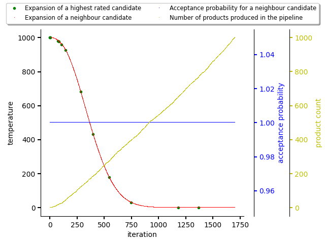
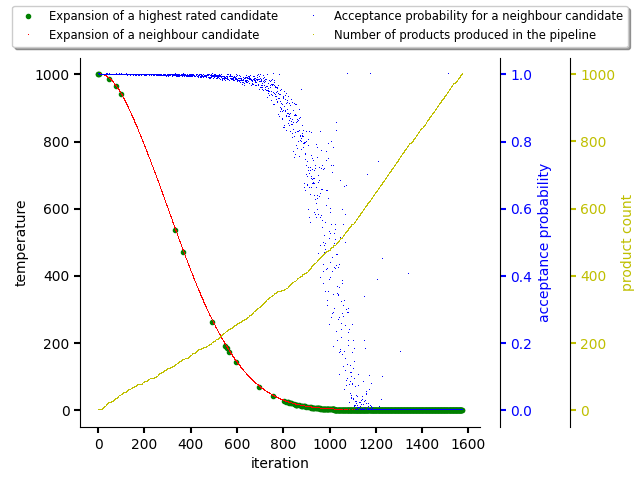
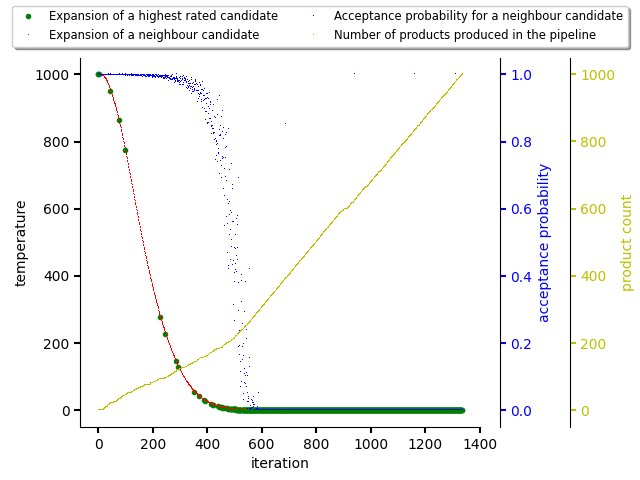
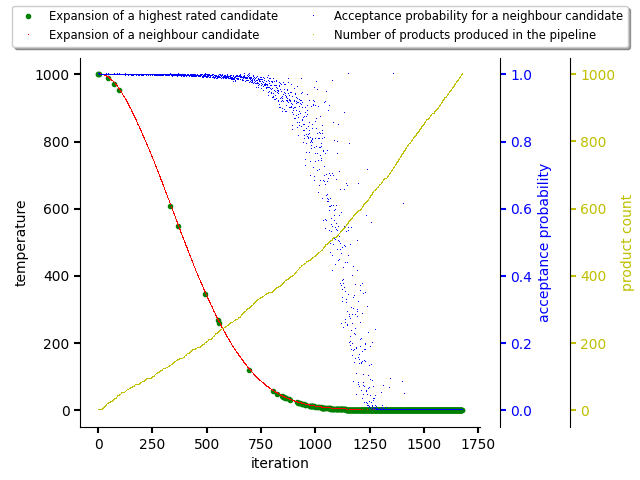

.. _annealing:

Predictor based on adaptive simulated annealing
-----------------------------------------------

.. note::

  Check :ref:`high level predictor docs <predictor>` for predictor basics.

See `Wikipedia
<https://en.wikipedia.org/wiki/Adaptive_simulated_annealing>`_ and also
`simulated annealing <https://en.wikipedia.org/wiki/Simulated_annealing>`_ for basics.

The adaptive simulated annealing part of adviser's resolution algorithm takes
either a top rated state for expansion or, based on probability, picks some
another state from the beam. This state is expanded by picking one dependency
from unresolved dependency listing and obtaining its direct dependencies making
the dependency resolved and direct dependencies becoming part of unresolved
dependency listing.  The probability of picking a neighbour state (and not the
highest rated stack) from beam is computed based on, besides other parameters,
the temperature function which respects number of iterations and number of
final states produced so far (thus "adaptive" simulated annealing).

See :class:`adaptive simulated annealing implementation
<thoth.adviser.predictors.AdaptiveSimulatedAnnealing>`.

An example of an adaptive simulated annealing run that produced 1000 Python
stacks (final states) with no observations on scored packages seen on the
following figure. As the database for scoring states is empty (Python stacks
were just resolved without any guidance), the probability of picking a random
state from the beam is high (the algorithm is looking for a state which would
be better than a score of 0.0 in comparision to a neighbour candidate with a
score of 0.0). This acceptance probability is kept even as the temperature
drops.

On the figure below, there was created a random dataset for scoring packages in
the resolution process for demonstration purposes. As can be seen, the
acceptance probability for picking a neighbour state for expansion is
decreasing with number of final states produced and with decreasing temperature
during iterations. This caused picking the highest rated states for expansion
and producing final states out of them (fully resolved Python software stacks).
Once temperature drops to 0.0, only highest rated software stack is picked for
resolution as acceptance probability for the neighbour state dropped to 0.0 as
well.

Temperature coefficient
=======================

Predictor based on adaptive simulated annealing (and all the derived ones),
accepts a parameter called ``temperature_coefficient``. This parameter is used
to specify how steep the temperature decrease should be. For reinforcement
learning based predictors (see :ref:`mcts` and
:ref:`temporal_difference_learning`) this parameter balances exploration and
exploitation phases. A usual values for this parameter are
``0.9<=temperature_coefficient<1.0``.

The figure below shows a simulated annealing run when
``temperature_coefficient`` is set to ``0.9``.

In comparision to figure above, the figure below shows another simulated
annealing run when ``temperature_coefficient`` is set to ``0.98``.

Even though in both cases there were used same input data and same seed for
random generator, results differ as steps taken by resolver differ across
iterations.

It's worth to adjust this parameter in a deployment based on time allocated for
adviser runs. The right value should make sure adviser is able to sample the
state space and perform exploitation of highest states found considering CPU
time allocated in the cluster pre a resolution request. See also
:ref:`deployment` section.
