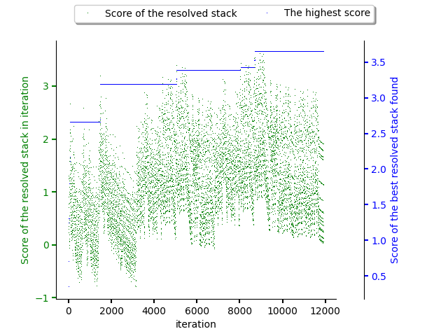

.. _hill_climbing:

Hill climbing
-------------

Another simple predictor is based on an optimization technique called
:class:`hill climbing <thoth.adviser.predictors.HillClimbing>`
(see `Wikipedia <https://en.wikipedia.org/wiki/Hill_climbing>`_). As any
resolver, it respects the current :class:`beam size <thoth.adviser.beam.Beam>`
and always picks the best solution found so far. The relative ordering in the
beam has a tendency to preserve package release ordering based on `Python
package version specifier <https://www.python.org/dev/peps/pep-0440/>`_.

The figure bellow shows hill climbing performed during resolution of a software
stack. The score gradually increases, taking always the top
rated state from the beam, finding a local optima (most probably, as hill
climbing is a `local search algorithm
<https://en.wikipedia.org/wiki/Local_search_(optimization)>`_).

