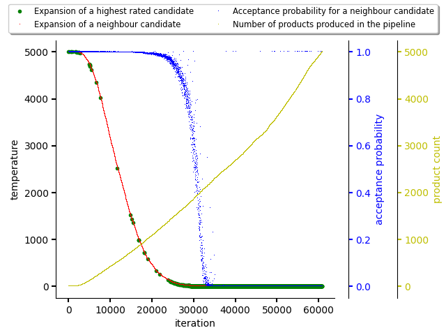
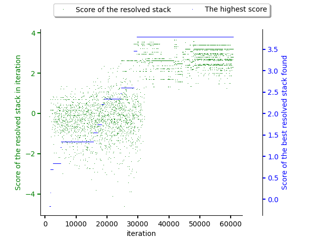
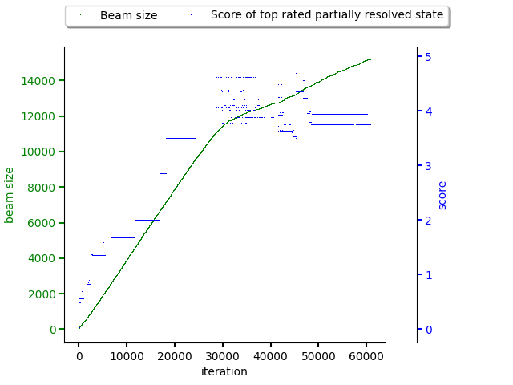

.. _mcts:

Predictor based on Monte Carlo Tree Search (MCTS)
-------------------------------------------------

.. note::

  Check :ref:`high level predictor docs <predictor>` for predictor basics.

This method is also many times referred as "Monte Carlo learning".

See `Wikipedia for a brief intro to MCTS
<https://en.wikipedia.org/wiki/Monte_Carlo_tree_search>`__.

The core idea lies in creating "trajectories" into dependency graph and learn
policy for which the software stacks should be resolved based on the reward
obtained.

The figures below show a resolution that is guided using an MCTS predictor.

The very first figure shows exploration and exploitation phases balancing using
annealing schedule. As can be seen, the exploitation phase finishes roughly in
iteration 30000 when the acceptance probability for expanding a neighbour
candidate drops to 0 and only the highest rated candidates are expanded
(exploitation).

.. note::

  The exploration and exploitation phase is balanced using an annealing
  schedule. The balance factor can be parametrized using
  ``temperature_coefficient`` parameter that can be supplied to the predictor.
  see :ref:`reinforcement learning intro section <rl_balancing>` for more info.

The second figure shows how software stacks produced by resolver increased they
score during the exploitation phase until circa 30000 iteration. This
corresponds to start of the exploitation phase. No better software stack was
resolved since then.

The last figure shows size of the beam keeping unresolved (partially resolved)
states. The max score of partially resolved states increase until iteration
30000 (exploration phase) and then the max score for partially resolved states
relatively stabilizes. It's also good to spot how the beam size behaves. Once
the exploration phase finishes, beam size does not increase that drastically.

It's also worth to point out the dataset used when creating plots was made out
of sparse scores.

See `this notebook that shows the resolution process using MCTS predictor
<https://github.com/thoth-station/notebooks/blob/master/notebooks/development/Gradient-free%20reinforcement%20learning%20predictors.ipynb>`__.
