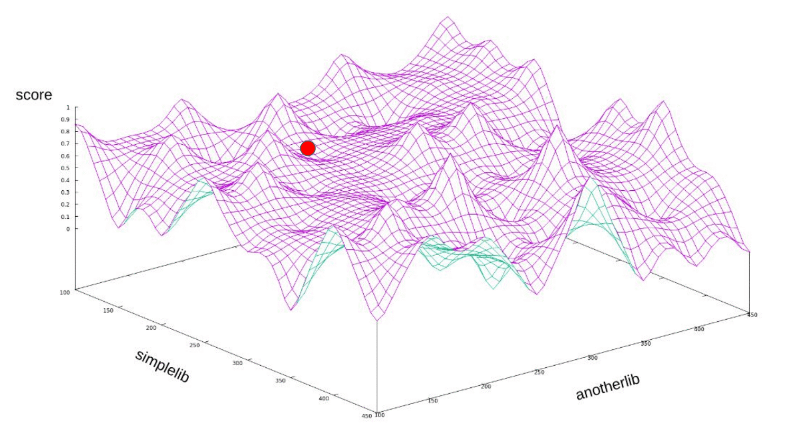
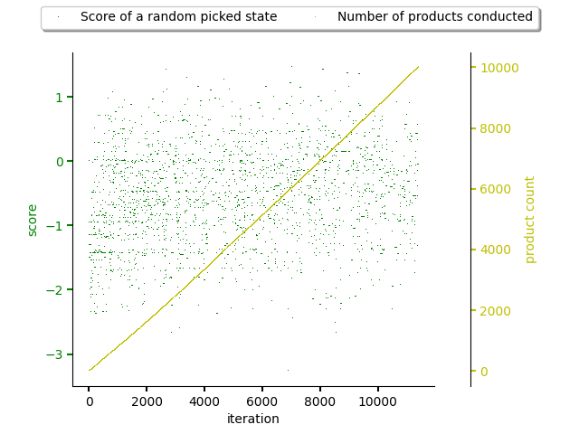

.. _random_walk:

Random walk based dependency graph sampling
-------------------------------------------

.. note::

  Check :ref:`high level predictor docs <predictor>` for predictor basics.

This predictor implements sampling of a dependency graph based on `Random walk
method <https://en.wikipedia.org/wiki/Random_walk>`_. You can see this method
as a random rays into dependency graph that resolve final states (fully pinned
down software stacks). :class:`The implementation
<thoth.adviser.predictors.RandomWalk>` is easy to understand when implementing
other predictors.

It's mostly suitable when dealing with `cold start problem
<https://en.wikipedia.org/wiki/Cold_start_(computing)>`_.

An example of using this predictor can be `seen in this YouTube video
<https://www.youtube.com/watch?v=S3hFn8KRsKc>`__ or `this blog post
<https://dev.to/fridex/how-to-beat-python-s-pip-dependency-monkey-inspecting-the-quality-of-tensorflow-dependencies-6fc>`__.
A summary of results can be seen in `this article
<https://developers.redhat.com/blog/2020/09/30/ai-software-stack-inspection-with-thoth-and-tensorflow/?sc_cid=7013a000002gbzfAAA>`__.

The predictor is suitable for sampling the state space of all the possible
software stacks to obtain a relevant dataset which could be further analyzed.
Once any issues or inspected aspects of software stacks are spotted, other
predictors could be used to narrow down to a issue maker (such as :ref:`package
combinations predictor <package_combinations>`).

The figure bellow shows random walk performed during resolution of a
software stack in a state space with random score assigned to packages. x-axis
shows resolver iterations and y-axis corresponds to scores computed. As can be
seen, the predictor does not learn state space characteristics to resolve
software stacks and randomly comes up with software stacks with any quality.

