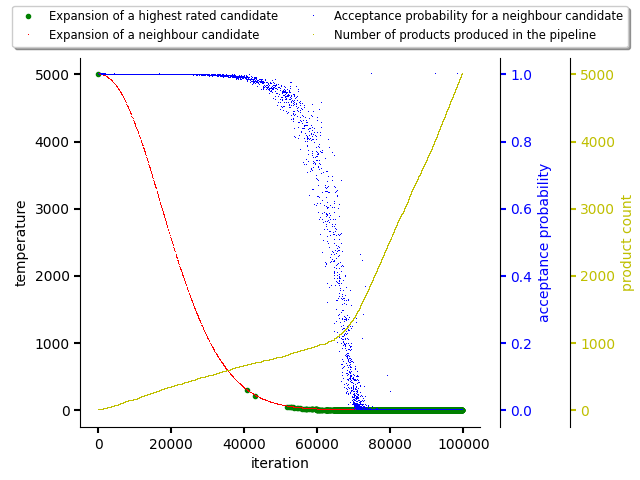
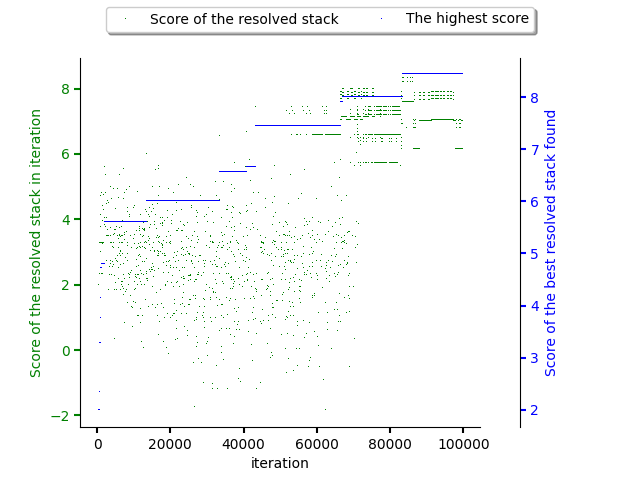

.. _temporal_difference_learning:

Predictor based on Temporal Difference learning (TD-learning)
-------------------------------------------------------------

.. note::

  Check :ref:`high level predictor docs <predictor>` for predictor basics.

See `Wikipedia for a brief intro to Temporal Difference learning
<https://en.wikipedia.org/wiki/Monte_Carlo_tree_search>`__.

Also check :ref:`Monte Carlo Tree Search <mcts>` for additional details..

.. image:: ../_static/td.gif
   :target: ../_static/td.gif
   :alt: Resolving software stacks with using TD-learning.

The figures below show the resolution process which is guided using
TD-learning.

The first figure shows the annealing schedule that is balancing exploration and
exploitation. The acceptance probability of a neighbour candidate starts to
significantly decrease approximately in iteration 70000. This collerates with
product creation cadence as exploitation phase is starting based on the resolution
progress.

Scores of software stacks reflect exploration and exploitation phase as well,
as can be seen in the figure below. The green dots reflecting score of the
states resolved are spread until approx. 70000th iteration of resolver when the
exploration phase slowly ends. The average score of software stacks produced
during the exploitation phase is higher. The best software stack candidate is
found in approx. 90000th resolver iteration in the exploitation phase.

Number of software stacks in beam grows until 70000th iteration after which it
starts to grow slower considering the exploitation phase start.

.. image:: ../_static/td_beam.png
   :target: ../_static/td_beam.png
   :alt: States captured in the resolver's beam.

.. note::

  The exploration and exploitation phase is balanced using an annealing
  schedule. The balance factor can be parametrized using
  ``temperature_coefficient`` parameter that can be supplied to the predictor.
  see :ref:`reinforcement learning intro section <rl_balancing>` for more info.

n-step TD-learning
==================

The implementation of predictor accepts a parameter "``step``" which turns on
n-step TD-learning behaviour. By default, the ``step`` parameter default to 1.

Tracing parameter in TD-learning
================================

Another parameter called ``trace`` can turn off propagation of the reward
signal to other resolved dependencies. It's not recommended to turn this
parameter on if step is not equal to 1.

The tracing can be turned off if the knowledge base does not provide causality
in steps (package X is scored in a better way if Y is part of the software
stack). In such cases, the resolution process can be faster.
