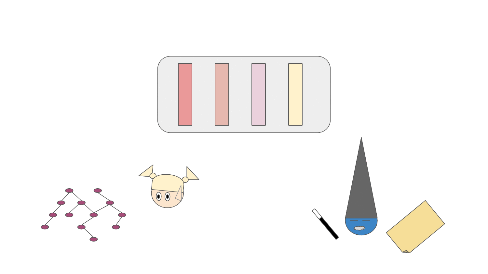

.. _resolver:

Thoth's resolver
----------------

As Python is a dynamic programming language, the actual resolution of Python
software stacks might take some time (you've probably `encountered this already
<https://github.com/pypa/pipenv/issues/2873>`_). One of the reasons behind it
is the fact that all packages need to be downloaded and installed to verify
version range satisfaction during the installation. This is also one of the
reasons Thoth builds its knowledge base - Thoth pre-computes dependencies in
the Python ecosystem so that resolving can be done offline without interacting
with the outside world.

Thoth's resolver models resolution process as a :ref:`Markov Decision
Process - see introduction section for more info <introduction>`.

Dependencies are are resolved based on pre-computed dependency information stored
in the Thoth's knowledge base. This information is aggregated by Thoth's `solvers
<https://github.com/thoth-station/solver>`_ that are run for different software
environments. An example can be a solver for Fedora:33 running Python3.9 or
UBI:8 running Python3.8. These software environments can be then used as base
software environments for running Python applications. These container images are
also suitable as a base for running Python applications
- see `s2i base images provided by Thoth <https://github.com/thoth-station/s2i-thoth>`_
that are analyzed by Thoth itself and thus can provide recommendations considering
the base image used.

Thoth's resolver has two main purposes:

* resolve software stacks for Dependency Monkey runs and verify generated
  software stacks on `Amun <https://github.com/thoth-station/amun-api>`_

* resolve software stacks for recommendations

To instantiate a resolver, one can use two main functions:

* :func:`Resolver.get_adviser_instance
  <thoth.adviser.resolver.Resolver.get_adviser_instance>` - a resolver that
  produces software stacks for recommendations

* :func:`Resolver.get_dependency_monkey_instance
  <thoth.adviser.resolver.Resolver.get_dependency_monkey_instance>` - a
  resolver that produces software stacks for :ref:`Dependency Monkey
  <dependency_monkey>`

.. note::

  `Check the linked Jupyter Notebook
  <https://github.com/thoth-station/notebooks/blob/master/notebooks/development/Gradient-free%20reinforcement%20learning%20predictors.ipynb>`__
  if you wish to dive into sources.

To resolve raw pipeline products, one can use :func:`Resolver.resolve_products
<thoth.adviser.resolver.Resolver.resolve_products>` method that yields raw
products during a pipeline run. Another method, :func:`Resolver.resolve
<thoth.adviser.resolver.Resolver.resolve>` creates a complete report of an
adviser run together with some additional pipeline run information. See
:ref:`pipeline section for code examples <pipeline>`.

.. note::

  Pipeline unit methods :func:`Unit.post_run_report
  <thoth.adviser.unit.Unit.post_run_report>` and predictor's
  :func:`Predictor.post_run_report
  <thoth.adviser.predictor.Predictor.post_run_report>` are called only when
  :func:`Resolver.resolve <thoth.adviser.resolver.Resolver.resolve>` method is
  used to resolve software stacks.

Resolver instance transparently runs :ref:`stack resolution pipeline
<pipeline>` to produce scored software stacks.

During the whole run, resolver keeps context that is updated during runs and is
accessible in pipeline units as well as passed to :ref:`predictor's run method
<predictor>` to guide resolver in next states to be resolve.
