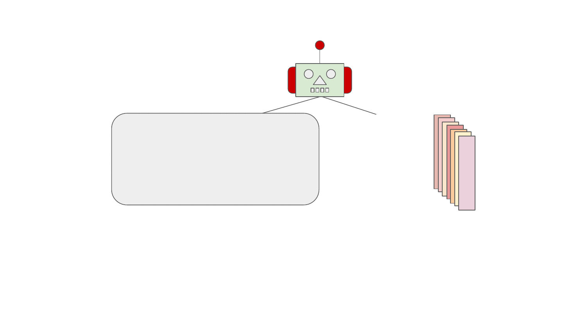

.. _unit:

A pipeline unit
---------------

.. note::

  This documentation section discusses about Python unit interface used in
  resolver.  You can use higher level abstraction in a form of
  :ref:`prescriptions <prescription>` in most cases.

All units are derived from :class:`Unit <thoth.adviser.unit.Unit>` that
provides a common base for implemented units of any type. The base class also
provides access to the input pipeline vectors and other properties that are
accessible by :class:`context abstraction <thoth.adviser.context.Context>`. See
:ref:`pipeline section <pipeline>` as a prerequisite for pipeline unit
documentation.

Note the instantiation of units is done once during pipeline creation - units
are kept instantiated during stack generation pipeline run.

Registering a pipeline unit to pipeline
=======================================

If the pipeline configuration is not explicitly supplied, Thoth's adviser
dynamically creates pipeline configuration (that is always the case in a
deployment).  This creation is done in a loop where each pipeline unit class of
a type (:ref:`boot <boots>`, :ref:`pseudonym <pseudonyms>`, :ref:`sieve
<sieves>`, :ref:`step <steps>`, :ref:`stride <strides>` and :ref:`wrap
<wraps>`) is asked for inclusion into the pipeline configuration - each
pipeline unit implementation is responsible for providing logic that states
when the given pipeline unit should be registered into the pipeline.

This logic is implemented as part of :func:`Unit.should_include
<thoth.adviser.unit.Unit.should_include>` class method:

.. code-block:: python

    from typing import Any
    from typing import Dict
    from typing import Generator

    from thoth.adviser import PipelineBuilderContext

    @classmethod
    def should_include(cls, builder_context: "PipelineBuilderContext") -> Generator[Dict[str, Any]]:
        """Check if the given pipeline unit should be included into pipeline."""
        if builder_context.is_adviser_pipeline() and not builder_context.is_included(cls):
            yield {"configuration1": 0.33}
            return None

        yield from ()
        return None

The :func:`Unit.should_include <thoth.adviser.unit.Unit.should_include>` class
method returns a generator which yields configuration for each pipeline unit
that should be registered into the pipeline configuration. The configuration is
a dictionary stating pipeline configuration that should be applied to pipeline
unit instance (an empty dictionary if no configuration changes are applied to
the default pipeline configuration but the pipeline unit should be included in
the pipeline configuration). The default configuration is provided by pipeline
in a dictionary available as a class attribute in
``Unit.CONFIGURATION_DEFAULT``.  See :ref:`unit configuration section
<unit_configuration>`.

When prescription pipeline units are called, directive ``should_include`` maps
to the ``should_include`` class method discussed above.

The pipeline configuration creation is done in multiple rounds so
:class:`PipelineBuilderContext
<thoth.adviser.pipeline_builder.PipelineBuilderContext>`, besides other
properties and routines, also provides
:func:`PipelineBuilderContext.is_included
<thoth.adviser.pipeline_builder.PipelineBuilderContext.is_included>` method
that checks if the given unit type is already present in the pipeline
configuration. As you can see, pipeline unit can become part of the pipeline
configuration multiple times based on requirements. See
:class:`PipelineBuilderContext
<thoth.adviser.pipeline_builder.PipelineBuilderContext>` for more information.

.. _unit_configuration:
Unit configuration
==================

Each unit can have instance specific configuration. The default configuration
can be supplied using :py:attr:`Unit.CONFIGURATION_DEFAULT
<thoth.adviser.unit.Unit.CONFIGURATION_DEFAULT>` class property in the derived
pipeline configuration type. Optionally, a schema of configuration can be
defined by providing :py:attr:`Unit.CONFIGURATION_SCHEMA
<thoth.adviser.unit.Unit.CONFIGURATION_SCHEMA>` in the derived pipeline
configuration type - this schema is used to verify unit configuration
correctness on unit instantiation.

Note units provide "``package_name``" configuration in the unit configuration
to state on which package they operate on (this option can be mandatory for
some of the units, such as pseudonyms). This configuration is used in resolver
internally to optimize calls to pipeline units. A ``None`` value lets pipeline
units work on any package. See unit specific documentation for more info.

Pipeline unit configuration is then accessible via :func:`Unit.configuration
<thoth.adviser.unit.Unit.configuration>` property on a unit instance which
returns a dictionary with configuration - the default updated with the one
returned by :func:`Unit.should_include
<thoth.adviser.unit.Unit.should_include>` class method on the pipeline unit
registration.

Debugging a unit run in cluster
===============================

Adviser constructs the resolution pipeline dynamically on each request and runs
units during the resolution. If you wish to see if a unit was registered to the
resolution pipeline and run, you can run the adviser in debug mode by providing
``--debug`` flag to ``thamos advise`` command. This will cause that the adviser
will run in a much more verbose mode and will report pipeline configuration and
all the actions that are done during the resolution.

Note that running adviser in a debug mode adds additional overhead to the
recommendation engine and slows it down. Results computed for two identical
requests where one is run in a debug mode might (and most often will) differ as
resolver will not be able to explore the state space given the time constraints
in the recommendation engine. Nevertheless, the debug mode gives additional
hints on pipeline configuration construction and actions done that might be
helpful in many cases.

If you wish to avoid the overhead issue described, it might be a good idea to
experiment with requirements (and possibly constraints as well) to narrow down
to the issue one wants to debug. An example can be a failure when adviser was
not able to find a resolution that would satisfy requirements. In such a case,
it might be good to generate a lock file with expected pinned set of packages
using other tools (e.g. Pipenv, pip-tools) and submit the lock file to the
recommender system. The logs produced during the resolution and stack level
justifications might give hints why the given resolution was rejected.

Justifications in the recommended software stacks
=================================================

Follow the :ref:`linked documentation for providing valuable information to
users on actions performed in pipeline units implemented <justifications>`.

Additional pipeline unit methods
================================

All pipeline unit types can implement the following methods that are triggered
in the described events:

* :func:`Unit.pre_run <thoth.adviser.unit.Unit.pre_run>` - called before running any pipeline unit with context already assigned
* :func:`Unit.post_run <thoth.adviser.unit.Unit.post_run>` - called after the resolution is finished
* :func:`Unit.post_run_report <thoth.adviser.unit.Unit.post_run_report>` - post-run method run after the resolving has finished - this method is called only if resolving with a report

Note the "post-run" methods are called in a reverse order to ``pre_run``. The
very first pipeline unit on which the pre-run method was called will be
notified as last after the pipeline finishes in its respective post-run method
implementation.

Pipeline unit module implementation placement
=============================================

To enable scaling adviser to cover specific nuances and to keep adviser
implementation clean, follow already created structure for pipeline units.

If a pipeline unit is pecific to a package, place it to a module named after
this package. An example can be a ``tf_21_urllib3`` module implementing
:class:`thoth.adviser.steps.tensorflow.tf_21_urllib3.TensorFlow21Urllib3Step`
step. As this unit is a type of ":ref:`step <steps>`", it is placed in
``thoth.adviser.steps``, subsequently ``thoth.adviser.steps.tensorflow`` states
this step is specific to `TensorFlow <https://pypi.org/project/tensorflow>`_
package.

All pipeline units specific to Python interpreter should go to ``python``
module under the respective pipeline unit type module (e.g.
``thoth.adviser.wraps.python`` for Python interpreter specific :ref:`wraps
<wraps>`).

Any other modules that are generic enough should be placed inside the top-level
module for the pipeline unit (e.g. inside ``thoth.adviser.sieves`` for a
:ref:`sieve <sieves>` specific units not specific to any Python interpreter or
any Python package).

An exception are also units used for debugging that should go to ``_debug``
module of the respective pipeline unit type module.

Afterword for pipeline units
============================

All units can raise :class:`thoth.adviser.exceptions.EagerStopPipeline` to
immediately terminate resolving and causing the resolver to report back all the
products computed so far.

Pipeline units of type :class:`Sieve <thoth.adviser.sieve.Sieve>` and
:class:`Step <thoth.adviser.step.Step>` can also raise :class:`NotAcceptable
<thoth.adviser.exceptions.NotAcceptable>`, see :ref:`sieves <sieves>` and
:ref:`steps <steps>` sections for more info.

Pipeline units of type :ref:`sieve <sieves>` and :ref:`step <steps>` can also
raise :class:`SkipPackage <thoth.adviser.exceptions.SkipPackage>` to exclude
the given package from an application stack completely. See :ref:`sieves
<sieves>` and :ref:`steps <steps>` section for more info.

Pipeline units of type :ref:`steps <steps>` can raise :class:`NotAcceptable
<thoth.adviser.exceptions.NotAcceptable>` signalizing the given step is not
acceptable (corresponds to "not-acceptable" action taken in the :ref:`Markov
Decision Process <introduction>`).

Raising any other exception in pipeline units causes undefined behavior.

All pipeline units should be atomic pieces and `they should do one thing and do
it well <https://en.wikipedia.org/wiki/Unix_philosophy>`_. They were designed
to be small pieces forming complex resolution system.

Unit placement in a pipeline
============================

The pipeline configuration (which pipeline units in what configuration) is
determined dynamically on each adviser start. This enables construction of the
pipeline depending on an input vector (e.g. packages used, Python indexes
configured, library usage, recommendation type and such). Each pipeline unit
requests to be registered to the pipeline configuration until the pipeline
configuration has been changed, indicating that the unit has been registered.
This loop respects ``__all__`` listing of the respective
``thoth.adviser.boots``, ``thoth.adviser.pseudonyms``,
``thoth.adviser.sieves``, ``thoth.adviser.strides``, ``thoth.adviser.steps``
and ``thoth.adviser.wraps`` module.

It's good to note how pipeline units should be listed in ``__all__``:

1. If a pipeline unit ``Foo`` depends on another pipeline unit, say ``Bar``, the
   pipeline unit ``Foo`` should be stated before ``Bar`` in the ``__all__`` listing.

2. It's a good practice to place pipeline units that remove/filter packages
   from an application stack sooner than pipeline units that perform other
   tasks (e.g. scoring, adding package information, ...). As packages are
   filtered, the code of other units is performed less time making the pipeline
   run more optimal.

3. If a pipeline unit ``Foo`` is less expensive than another pipeline unit, say
   ``Bar``, the pipeline unit ``Foo`` should be stated before ``Bar`` in the
   ``__all__`` listing.

An example of a pipeline unit that is considered expensive is a pipeline unit
that performs a knowledge graph query

Which pipeline unit type should be chosen?
==========================================

Sometimes it might be tricky to select the right pipeline unit. Multiple unit
types were designed to provide a framework for resolver to easily write units.
These units have different overhead and are designed for specific use cases.
It's crucial to select the right pipeline unit for the right use case to keep
the pipeline performing well.

The most expensive pipeline units are :ref:`steps <steps>`. They are run each
time a package is about to be added to resolver's internal state. As it is the
most expensive one, it also provides the most information for a pipeline unit
developer - which package in which specific version is about to be added to a
partially resolved state and what the resolver state looks like. These units
are the only ones that can affect the final unit score. Make sure these units
provide a package to which they correspond if they are specific to packages
(the ``package_name`` configuration) - this enables optimization which performs
the unit call only if the given unit should be called.

The second most expensive pipeline units are :ref:`sieves <sieves>`. They do
not provide access to resolver's internal state, but are called each time there
are packages in specific versions considered for further resolution. As the
name suggests, these units filter out packages that should not occur in the
final software stack. These units, unlike :ref:`steps <steps>`, do not provide
access to resolver's internal state (states are created out of the packages
that were not filtered by sieves).

The third most expensive units are :ref:`pseudonyms <pseudonyms>`. They can
provide "pseudonyms" - alternative packages published under different name or
alternative versions that can be used (or both assumptions).

The fourth most expensive pipeline units are :ref:`strides <strides>`. They are
called on each fully resolved state that eventually form the recommended
software stack (hence become final states).

The most cheapest pipeline units are :ref:`boots <boots>` and :ref:`wraps
<wraps>`. Boot pipeline unit types were designed to prepare resolver, the input
vector coming to the resolver or pipeline units. Wrap pipeline unit types make
final changes to final states that are not relevant to the state score,
packages resolved in the final state or resolver input vector.

Refer to sections specific to pipeline unit types for examples and more
information.

Unroll pipeline units
=====================

To keep the resolver performing well, try to always unroll all the operations
that do not need to be included in the actual pipeline unit run method and put
these operations to pre or post run methods. In that case, pipeline units can
configure/prepare for a resolver run in advance, keeping the initialization
part out of the actual pipeline run. Note the ``run`` method of a pipeline unit
can be called thousands times in a single resolver run so optimizing these
pieces matter a lot.
